# Ray Tracing in One Weekend

> 练习一下rust，使用rust重制一下rtweekend

## 输出一个ppm照片

ppm的格式第一行"P3"，第二行"宽 高""，第三行最大值，然后是RGB三通道数据，每行一个像素，每行用空格隔开

使用重定向符输出到ppm文件

可以添加一些调试信息，显示进度（现在比较快不明显，你也可以使用延时函数查看一下）

```rust
use std::io::{self, Write};

fn main() {
    let image_wideth = 256;
    let image_height = 256;

    println!("P3\n{} {}\n255\n", image_wideth, image_height);

    for j in (0..image_height).rev() {
        eprint!("\rScanlines remaining: {}   ", j);
        io::stderr().flush().unwrap();

        for i in 0..image_wideth {
            let r = i as f64 / image_wideth as f64;
            let g = j as f64 / image_height as f64;
            let b = 0.0;

            let ir = (255.999 * r) as i32;
            let ig = (255.999 * g) as i32;
            let ib = (255.999 * b) as i32;
            println!("{} {} {}", ir, ig, ib);
        }
    }
    eprintln!("Done.");
}

```

## 完成vec3类

完成vec3类，便于一次性直接计算三个像素值或者空间坐标vec3.rs

```rust
use std::fmt;
use std::ops::{Add, AddAssign, MulAssign, SubAssign, DivAssign, Div, Mul, Neg, Sub};

#[derive(Clone, Copy, Debug, Default)]
pub struct Vec3 {
    pub e: [f64; 3],
}

pub type Point3 = Vec3;

impl Vec3 {
    // 构造函数
    pub fn new(e0: f64, e1: f64, e2: f64) -> Self {
        Self { e: [e0, e1, e2] }
    }

    pub fn x(&self) -> f64 {
        self.e[0]
    }
    pub fn y(&self) -> f64 {
        self.e[1]
    }
    pub fn z(&self) -> f64 {
        self.e[2]
    }

    pub fn length(&self) -> f64 {
        self.length_squared().sqrt()
    }

    pub fn length_squared(&self) -> f64 {
        self.e[0] * self.e[0] + self.e[1] * self.e[1] + self.e[2] * self.e[2]
    }

    // 常用向量操作方法
    pub fn dot(u: &Vec3, v: &Vec3) -> f64 {
        u.e[0] * v.e[0] + u.e[1] * v.e[1] + u.e[2] * v.e[2]
    }

    pub fn cross(u: &Vec3, v: &Vec3) -> Vec3 {
        Vec3::new(
            u.e[1] * v.e[2] - u.e[2] * v.e[1],
            u.e[2] * v.e[0] - u.e[0] * v.e[2],
            u.e[0] * v.e[1] - u.e[1] * v.e[0],
        )
    }

    pub fn unit_vector(v: Vec3) -> Vec3 {
        v / v.length()
    }
}

// --- 运算符重载 ---

// 索引操作: v[i]
impl std::ops::Index<usize> for Vec3 {
    type Output = f64;
    fn index(&self, i: usize) -> &f64 {
        &self.e[i]
    }
}

impl std::ops::IndexMut<usize> for Vec3 {
    fn index_mut(&mut self, i: usize) -> &mut f64 {
        &mut self.e[i]
    }
}

// 取反: -v
impl Neg for Vec3 {
    type Output = Vec3;
    fn neg(self) -> Vec3 {
        Vec3::new(-self.e[0], -self.e[1], -self.e[2])
    }
}

// 加法: u + v
impl Add for Vec3 {
    type Output = Vec3;
    fn add(self, v: Vec3) -> Vec3 {
        Vec3::new(self.e[0] + v.e[0], self.e[1] + v.e[1], self.e[2] + v.e[2])
    }
}

// 减法: u - v
impl Sub for Vec3 {
    type Output = Vec3;
    fn sub(self, v: Vec3) -> Vec3 {
        Vec3::new(self.e[0] - v.e[0], self.e[1] - v.e[1], self.e[2] - v.e[2])
    }
}

// 向量乘法(点乘): u * v
impl Mul for Vec3 {
    type Output = Vec3;
    fn mul(self, v: Vec3) -> Vec3 {
        Vec3::new(self.e[0] * v.e[0], self.e[1] * v.e[1], self.e[2] * v.e[2])
    }
}

// 标量乘法: v * t
impl Mul<f64> for Vec3 {
    type Output = Vec3;
    fn mul(self, t: f64) -> Vec3 {
        Vec3::new(self.e[0] * t, self.e[1] * t, self.e[2] * t)
    }
}

// 标量乘法: t * v （类型不同）
impl Mul<Vec3> for f64 {
    type Output = Vec3;
    fn mul(self, v: Vec3) -> Vec3 {
        v * self
    }
}

// 除法: v / t
impl Div<f64> for Vec3 {
    type Output = Vec3;
    fn div(self, t: f64) -> Vec3 {
        self * (1.0 / t)
    }
}

// 自增: v += u
impl AddAssign for Vec3 {
    fn add_assign(&mut self, v: Vec3) {
        *self = *self + v;
    }
}
// 自减: v -= u
impl SubAssign for Vec3 {
    fn sub_assign(&mut self, v: Vec3) {
        *self = *self - v;
    }
}

// 自乘: v *= t
impl MulAssign<f64> for Vec3 {
    fn mul_assign(&mut self, t: f64) {
        *self = *self * t;
    }
}

// 自除: v /= t
impl DivAssign<f64> for Vec3 {
    fn div_assign(&mut self, t: f64) {
        *self = *self / t;
    }
}

// 显示输出: println!("{}", v)
impl fmt::Display for Vec3 {
    fn fmt(&self, f: &mut fmt::Formatter) -> fmt::Result {
        write!(f, "{} {} {}", self.e[0], self.e[1], self.e[2])
    }
}

```

封装一下像素颜色color.rs

```rust
use crate::vec3::Vec3;
use std::io::{Write};

pub type Color = Vec3;

pub fn write_color<W: Write>(out: &mut W, pixel_color: Color) -> std::io::Result<()> {
    let r = pixel_color.x();
    let g = pixel_color.y();
    let b = pixel_color.z();

    // 将 [0,1] 映射到字节范围 [0,255]
    let rbyte = (255.999 * r) as i32;
    let gbyte = (255.999 * g) as i32;
    let bbyte = (255.999 * b) as i32;

    // 写入像素颜色分量
    writeln!(out, "{} {} {}", rbyte, gbyte, bbyte)
}


```

更新main.rs

```rust
mod color;
mod vec3;

use crate::color::{Color, write_color};
use std::io::{self, Write};

fn main() -> io::Result<()> {
    let image_width = 256;
    let image_height = 256;

    println!("P3\n{} {}\n255", image_width, image_height);

    for j in 0..image_height {
        eprint!("\rScanlines remaining: {:3} ", image_height - j);
        io::stderr().flush()?;

        for i in 0..image_width {
            let pixel_color = Color::new(
                i as f64 / (image_width - 1) as f64,
                j as f64 / (image_height - 1) as f64,
                0.0,
            );

            write_color(&mut io::stdout(), pixel_color)?;
        }
    }

    eprintln!("\nDone.                 ");
    Ok(())
}

```

## 光线、摄像机、背景

## 光线

光线就是一条直线，参考带你，参考方向和距离

$$
\bm{R}(t)=\bm{A}+t\bm{b}
$$

实现ray.rs

```rust
use crate::vec3::{Vec3, Point3};

pub struct Ray {
    pub orig: Point3,
    pub dir: Vec3,
}

impl Ray {
    pub fn new(origin: Point3, direction: Vec3) -> Self {
        Self { orig: origin, dir: direction }
    }

    pub fn origin(&self) -> Point3 {
        self.orig
    }

    pub fn direction(&self) -> Vec3 {
        self.dir
    }

    pub fn at(&self, t: f64) -> Point3 {
        self.orig + t * self.dir
    }
}
```

相机就是我们程序计算的是一个虚拟的平面，也就是相机，但是通常左上角才是00，但是相机对的是正中心，所以需要进行一些坐标转换

背景的话通过混合两种颜色来实现渐变

完整的main.rs

```rust
use crate::vec3::{Vec3, Point3};

pub struct Ray {
    pub orig: Point3,
    pub dir: Vec3,
}

impl Ray {
    pub fn new(origin: Point3, direction: Vec3) -> Self {
        Self { orig: origin, dir: direction }
    }

    pub fn origin(&self) -> Point3 {
        self.orig
    }

    pub fn direction(&self) -> Vec3 {
        self.dir
    }

    pub fn at(&self, t: f64) -> Point3 {
        self.orig + t * self.dir
    }
}
```


## 增加球体

我们希望加入一个球，并且光线射到这个球我们就得到别的颜色，求相交就是解方程判断求根公式

求根的小技巧是，下面的2除上去，把含b都转换为b/2，这样可以减少计算次数，更新main.rs

```rust
fn hit_sphere(center: Point3, radius: f64, r: &Ray) -> bool {
    let oc = r.origin() - center;
    let a = r.direction().length_squared();
    let half_b = Vec3::dot(&oc, &r.direction());
    let c = oc.length_squared() - radius * radius;
    let discriminant = half_b * half_b - a * c;
    discriminant >= 0.0
}

fn ray_color(r: &Ray) -> Color {
    if (hit_sphere(Point3::new(0.0, 0.0, -1.0), 0.5, r)) {
        return Color::new(1.0, 0.0, 0.0);
    }

    let unit_direction = Vec3::unit_vector(r.direction());
    let t = 0.5 * (unit_direction.y() + 1.0);
    (1.0 - t) * Color::new(1.0, 1.0, 1.0) + t * Color::new(0.5, 0.7, 1.0)
}
```

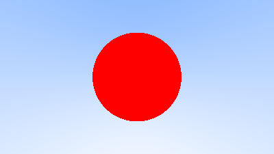

## 法向量和多物体

### 法线

目前法向量很简单，就是相交点和球心的向量，更新main.rs

```rust
fn hit_sphere(center: Point3, radius: f64, r: &Ray) -> f64 {
    let oc = r.origin() - center;
    let a = r.direction().length_squared();
    let half_b = Vec3::dot(&oc, &r.direction());
    let c = oc.length_squared() - radius * radius;
    let discriminant = half_b * half_b - a * c;
    if discriminant >= 0.0 {
        return (-half_b - discriminant.sqrt()) / a;
    } else {
        return -1.0;
    }
}

fn ray_color(r: &Ray) -> Color {
    let t = hit_sphere(Point3::new(0.0, 0.0, -1.0), 0.5, r);
    if (t > 0.0) {
        let N = Vec3::unit_vector(r.at(t) - Vec3::new(0.0, 0.0, -1.0));
        return 0.5 * Color::new(N.x() + 1.0, N.y() + 1.0, N.z() + 1.0);
    }

    let unit_direction = Vec3::unit_vector(r.direction());
    let t = 0.5 * (unit_direction.y() + 1.0);
    (1.0 - t) * Color::new(1.0, 1.0, 1.0) + t * Color::new(0.5, 0.7, 1.0)
}

```

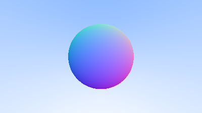

## 多物体

### 抽象物体和物体列表

将球体抽象成可以被光线照射的物体hittable.rs

然后我们希望确当法线的方向是向内还是向外，有两种方案，一种是始终向外一种是始终反向，这里选择后者。因为本项目材质多于几何类型（实际上就是只有球），前者在着色处计算，后者在求交处计算

然后我们还需要多物体组成列表

histtable.rs

```rust
use crate::ray::Ray;
use crate::vec3::{Point3, Vec3};

#[derive(Clone, Copy, Debug, Default)]
pub struct HitRecord {
    pub p: Point3,
    pub normal: Vec3,
    pub t: f64,
    pub front_face: bool,
}

impl HitRecord {
    pub fn set_face_normal(&mut self, r: &Ray, outward_normal: Vec3) {
        self.front_face = Vec3::dot(&r.direction(), &outward_normal) < 0.0;
        self.normal = if self.front_face {
            outward_normal
        } else {
            -outward_normal
        };
    }
}

pub trait Hittable: Send + Sync {
    fn hit(&self, r: &Ray, ray_t_min: f64, ray_t_max: f64, rec: &mut HitRecord) -> bool;
}

```

然后创建sphere.rs（其实这里不太符合rust的规范）

```rust
use crate::vec3::{Vec3, Point3};
use crate::ray::Ray;
use crate::hittable::{Hittable, HitRecord};

pub struct Sphere {
    center: Point3,
    radius: f64,
}

impl Sphere {
    pub fn new(center: Point3, radius: f64) -> Self {
        Self {
            center,
            radius: radius.max(0.0),
        }
    }
}

impl Hittable for Sphere {
    fn hit(&self, r: &Ray, ray_t_min: f64, ray_t_max: f64, rec: &mut HitRecord) -> bool {
        let oc = self.center - r.origin();
        let a = r.direction().length_squared();
        let h = Vec3::dot(&r.direction(), &oc);
        let c = oc.length_squared() - self.radius * self.radius;

        let discriminant = h * h - a * c;
        if discriminant < 0.0 {
            return false;
        }

        let sqrtd = discriminant.sqrt();

        // 寻找在范围内最近的根
        let mut root = (h - sqrtd) / a;
        if root <= ray_t_min || ray_t_max <= root {
            root = (h + sqrtd) / a;
            if root <= ray_t_min || ray_t_max <= root {
                return false;
            }
        }

        rec.t = root;
        rec.p = r.at(rec.t);
        let outward_normal = (rec.p - self.center) / self.radius;
  
        rec.set_face_normal(r, outward_normal);

        true
    }
}
```

hittable_list

```rust
use std::sync::Arc;
use crate::ray::Ray;
use crate::hittable::{Hittable, HitRecord};

pub struct HittableList {
    // Arc 允许多个所有者，dyn 允许存储不同的物体
    pub objects: Vec<Arc<dyn Hittable>>,
}

impl HittableList {
    pub fn new() -> Self {
        Self { objects: Vec::new() }
    }

    pub fn clear(&mut self) {
        self.objects.clear();
    }

    // 这里参数改为接收一个 Arc 包裹的对象
    pub fn add(&mut self, object: Arc<dyn Hittable>) {
        self.objects.push(object);
    }
}

impl Hittable for HittableList {
    fn hit(&self, r: &Ray, ray_t_min: f64, ray_t_max: f64, rec: &mut HitRecord) -> bool {
        let mut temp_rec = HitRecord::default();
        let mut hit_anything = false;
        let mut closest_so_far = ray_t_max;

        for object in &self.objects {
            // object 是 Arc<dyn Hittable>，调用方法时会自动解引用
            if object.hit(r, ray_t_min, closest_so_far, &mut temp_rec) {
                hit_anything = true;
                closest_so_far = temp_rec.t;
                *rec = temp_rec.clone();
            }
        }

        hit_anything
    }
}
```

### 优化导入

原文是使用了一个公用的头文件，而我们直接使用lib.rs即可（后面lib的更新就不记录了）

```rust
pub mod color;
pub mod hittable;
pub mod hittable_list;
pub mod ray;
pub mod sphere;
pub mod vec3;

pub use color::{Color, write_color};
pub use hittable::{HitRecord, Hittable};
pub use hittable_list::HittableList;
pub use ray::Ray;
pub use sphere::Sphere;
pub use vec3::{Point3, Vec3};

pub const INFINITY: f64 = f64::INFINITY;
pub const PI: f64 = std::f64::consts::PI;

pub fn degrees_to_radians(degrees: f64) -> f64 {
    degrees * PI / 180.0
}

```

更新的main.rs(trweekedn4r就是我们的项目名称，也就是相当于包含lib.rs)

```rust
use std::io::{self, Write};
use std::sync::Arc;
use trweekend4r::{Color, Hittable, HittableList, Point3, Ray, Sphere, Vec3, write_color};

fn ray_color(r: &Ray, world: &dyn Hittable) -> Color {
    let mut rec = Default::default();
    if world.hit(r, 0.0, f64::INFINITY, &mut rec) {
        return 0.5 * (rec.normal + Color::new(1.0, 1.0, 1.0));
    }

    let unit_direction = Vec3::unit_vector(r.direction());
    let t = 0.5 * (unit_direction.y() + 1.0);
    (1.0 - t) * Color::new(1.0, 1.0, 1.0) + t * Color::new(0.5, 0.7, 1.0)
}

fn main() -> io::Result<()> {
    // Image
    let aspect_ratio = 16.0 / 9.0;
    let image_width = 400;

    let mut image_height = (image_width as f64 / aspect_ratio) as i32;
    image_height = if image_height < 1 { 1 } else { image_height };

    // World
    let mut world = HittableList::new();
    world.add(Arc::new(Sphere::new(Point3::new(0.0, 0.0, -1.0), 0.5)));
    world.add(Arc::new(Sphere::new(Point3::new(0.0, -100.5, -1.0), 100.0)));

    // Camera
    let focal_length = 1.0;
    let viewport_height = 2.0;
    let viewport_width = aspect_ratio * viewport_height;
    let camera_center = Point3::new(0.0, 0.0, 0.0);

    // Calculate the vectors across the horizontal and down the vertical viewport edges.
    let viewport_u = Vec3::new(viewport_width, 0.0, 0.0);
    let viewport_v = Vec3::new(0.0, -viewport_height, 0.0);

    // Calculate the horizontal and vertical delta vectors from pixel to pixel.
    let pixel_delta_u = viewport_u / image_width as f64;
    let pixel_delta_v = viewport_v / image_height as f64;

    // Calculate the location of the upper left pixel.
    let viewport_upper_left =
        camera_center - Vec3::new(0.0, 0.0, focal_length) - viewport_u / 2.0 - viewport_v / 2.0;

    let pixel00_loc = viewport_upper_left + 0.5 * (pixel_delta_u + pixel_delta_v);

    // Render
    println!("P3\n{} {}\n255", image_width, image_height);

    for j in 0..image_height {
        eprint!("\rScanlines remaining: {:3} ", image_height - j);
        io::stderr().flush()?;

        for i in 0..image_width {
            let pixel_center =
                pixel00_loc + (i as f64) * pixel_delta_u + (j as f64) * pixel_delta_v;

            let ray_direction = pixel_center - camera_center;
            let ray = Ray::new(camera_center, ray_direction);

            let pixel_color = ray_color(&ray, &world);
            write_color(&mut io::stdout(), pixel_color)?;
        }
    }

    eprintln!("\nDone.");
    Ok(())
}

```

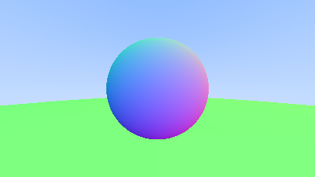

## 区间类

区间类，便于钳制数值范围和判断

```rust
use std::f64::{INFINITY, NEG_INFINITY};

#[derive(Clone, Copy, Debug)]
pub struct Interval {
    pub min: f64,
    pub max: f64,
}

impl Default for Interval {
    fn default() -> Self {
        Self::EMPTY
    }
}

impl Interval {
    pub const EMPTY: Self = Self {
        min: INFINITY,
        max: NEG_INFINITY,
    };

    pub const UNIVERSE: Self = Self {
        min: NEG_INFINITY,
        max: INFINITY,
    };

    pub fn new(min: f64, max: f64) -> Self {
        Self { min, max }
    }

    pub fn size(&self) -> f64 {
        self.max - self.min
    }

    pub fn contains(&self, x: f64) -> bool {
        self.min <= x && x <= self.max
    }

    pub fn surrounds(&self, x: f64) -> bool {
        self.min < x && x < self.max
    }

    pub fn clamp(&self, x: f64) -> f64 {
        if x < self.min {
            return self.min;
        }
        if x > self.max {
            return self.max;
        }
        x
    }
}

```

然后更新hittable、hittable_list和main（我也不记得换那几行了，反正就是把ray_t_max(min)换成传入interval的示例ray_t）

更新后的三个完整文件

```rust
\\hittable.rs
use crate::ray::Ray;
use crate::vec3::{Point3, Vec3};
use crate::interval::Interval;

#[derive(Clone, Copy, Debug, Default)]
pub struct HitRecord {
    pub p: Point3,
    pub normal: Vec3,
    pub t: f64,
    pub front_face: bool,
}

impl HitRecord {
    pub fn set_face_normal(&mut self, r: &Ray, outward_normal: Vec3) {
        self.front_face = Vec3::dot(&r.direction(), &outward_normal) < 0.0;
        self.normal = if self.front_face {
            outward_normal
        } else {
            -outward_normal
        };
    }
}

pub trait Hittable: Send + Sync {
    fn hit(&self, r: &Ray, ray_t: Interval, rec: &mut HitRecord) -> bool;
}
\\hittable_list.rs
use crate::hittable::{HitRecord, Hittable};
use crate::interval::Interval;
use crate::ray::Ray;
use std::sync::Arc;

pub struct HittableList {
    // Arc 允许多个所有者，dyn 允许存储不同的物体
    pub objects: Vec<Arc<dyn Hittable>>,
}

impl HittableList {
    pub fn new() -> Self {
        Self {
            objects: Vec::new(),
        }
    }

    pub fn clear(&mut self) {
        self.objects.clear();
    }

    // 这里参数改为接收一个 Arc 包裹的对象
    pub fn add(&mut self, object: Arc<dyn Hittable>) {
        self.objects.push(object);
    }
}

impl Hittable for HittableList {
    fn hit(&self, r: &Ray, ray_t: Interval, rec: &mut HitRecord) -> bool {
        let mut temp_rec = HitRecord::default();
        let mut hit_anything = false;
        let mut closest_so_far = ray_t.max;

        for object in &self.objects {
            // 递进式缩小搜索区间，找最近的碰撞点
            let current_t = Interval::new(ray_t.min, closest_so_far);
            if object.hit(r, current_t, &mut temp_rec) {
                hit_anything = true;
                closest_so_far = temp_rec.t;
                *rec = temp_rec.clone();
            }
        }

        hit_anything
    }
}
\\main.rs
use std::io::{self, Write};
use std::sync::Arc;
use trweekend4r::{Color, Hittable, HittableList, Point3, Ray, Sphere, Vec3, write_color, Interval};

fn ray_color(r: &Ray, world: &dyn Hittable) -> Color {
    let mut rec = Default::default();
    let ray_t = Interval::new(0.0, f64::INFINITY);
    if world.hit(r, ray_t, &mut rec) {
        return 0.5 * (rec.normal + Color::new(1.0, 1.0, 1.0));
    }

    let unit_direction = Vec3::unit_vector(r.direction());
    let t = 0.5 * (unit_direction.y() + 1.0);
    (1.0 - t) * Color::new(1.0, 1.0, 1.0) + t * Color::new(0.5, 0.7, 1.0)
}

fn main() -> io::Result<()> {
    // Image
    let aspect_ratio = 16.0 / 9.0;
    let image_width = 400;

    let mut image_height = (image_width as f64 / aspect_ratio) as i32;
    image_height = if image_height < 1 { 1 } else { image_height };

    // World
    let mut world = HittableList::new();
    world.add(Arc::new(Sphere::new(Point3::new(0.0, 0.0, -1.0), 0.5)));
    world.add(Arc::new(Sphere::new(Point3::new(0.0, -100.5, -1.0), 100.0)));

    // Camera
    let focal_length = 1.0;
    let viewport_height = 2.0;
    let viewport_width = aspect_ratio * viewport_height;
    let camera_center = Point3::new(0.0, 0.0, 0.0);

    // Calculate the vectors across the horizontal and down the vertical viewport edges.
    let viewport_u = Vec3::new(viewport_width, 0.0, 0.0);
    let viewport_v = Vec3::new(0.0, -viewport_height, 0.0);

    // Calculate the horizontal and vertical delta vectors from pixel to pixel.
    let pixel_delta_u = viewport_u / image_width as f64;
    let pixel_delta_v = viewport_v / image_height as f64;

    // Calculate the location of the upper left pixel.
    let viewport_upper_left =
        camera_center - Vec3::new(0.0, 0.0, focal_length) - viewport_u / 2.0 - viewport_v / 2.0;

    let pixel00_loc = viewport_upper_left + 0.5 * (pixel_delta_u + pixel_delta_v);

    // Render
    println!("P3\n{} {}\n255", image_width, image_height);

    for j in 0..image_height {
        eprint!("\rScanlines remaining: {:3} ", image_height - j);
        io::stderr().flush()?;

        for i in 0..image_width {
            let pixel_center =
                pixel00_loc + (i as f64) * pixel_delta_u + (j as f64) * pixel_delta_v;

            let ray_direction = pixel_center - camera_center;
            let ray = Ray::new(camera_center, ray_direction);

            let pixel_color = ray_color(&ray, &world);
            write_color(&mut io::stdout(), pixel_color)?;
        }
    }

    eprintln!("\nDone.");
    Ok(())
}

```

## 摄像机

把摄像机封装成camera.rs

```rust
use crate::color::Color;
use crate::hittable::{HitRecord, Hittable};
use crate::interval::Interval;
use crate::ray::Ray;
use crate::vec3::{Point3, Vec3};
use std::f64::INFINITY;
use std::io::{self, Write};

pub struct Camera {
    pub aspect_ratio: f64, // 图像宽高比
    pub image_width: i32,  // 图像宽度

    // 私有计算变量
    image_height: i32,   // 图像高度
    center: Point3,      // 相机中心
    pixel00_loc: Point3, // 像素 (0,0) 的位置
    pixel_delta_u: Vec3, // 相邻像素水平间距
    pixel_delta_v: Vec3, // 相邻像素垂直间距
}

impl Camera {
    pub fn new() -> Self {
        Self {
            aspect_ratio: 1.0,
            image_width: 100,
            image_height: 0,
            center: Point3::new(0.0, 0.0, 0.0),
            pixel00_loc: Point3::new(0.0, 0.0, 0.0),
            pixel_delta_u: Vec3::new(0.0, 0.0, 0.0),
            pixel_delta_v: Vec3::new(0.0, 0.0, 0.0),
        }
    }

    pub fn render(&mut self, world: &dyn Hittable) -> std::io::Result<()> {
        self.initialize();

        // 打印 PPM 格式头
        println!("P3\n{} {}\n255", self.image_width, self.image_height);

        for j in 0..self.image_height {
            eprint!("\rScanlines remaining: {:3} ", self.image_height - j);
            io::stderr().flush()?;

            for i in 0..self.image_width {
                let pixel_center = self.pixel00_loc
                    + (i as f64 * self.pixel_delta_u)
                    + (j as f64 * self.pixel_delta_v);

                let ray_direction = pixel_center - self.center;
                let r = Ray::new(self.center, ray_direction);

                let pixel_color = self.ray_color(&r, world);
                crate::color::write_color(&mut io::stdout(), pixel_color)?;
            }
        }
        eprintln!("\nDone.");
        Ok(())
    }

    fn initialize(&mut self) {
        // 计算图像高度，确保至少为 1
        self.image_height = (self.image_width as f64 / self.aspect_ratio) as i32;
        if self.image_height < 1 {
            self.image_height = 1;
        }

        self.center = Point3::new(0.0, 0.0, 0.0);

        // 视口 (Viewport) 设置
        let focal_length = 1.0;
        let viewport_height = 2.0;
        let viewport_width = viewport_height * (self.image_width as f64 / self.image_height as f64);

        // 计算视口边沿向量
        let viewport_u = Vec3::new(viewport_width, 0.0, 0.0);
        let viewport_v = Vec3::new(0.0, -viewport_height, 0.0);

        // 计算像素间距向量
        self.pixel_delta_u = viewport_u / self.image_width as f64;
        self.pixel_delta_v = viewport_v / self.image_height as f64;

        // 计算左上角像素位置
        let viewport_upper_left =
            self.center - Vec3::new(0.0, 0.0, focal_length) - viewport_u / 2.0 - viewport_v / 2.0;

        self.pixel00_loc = viewport_upper_left + 0.5 * (self.pixel_delta_u + self.pixel_delta_v);
    }

    fn ray_color(&self, r: &Ray, world: &dyn Hittable) -> Color {
        let mut rec: HitRecord = Default::default();

        // 使用 Interval 来定义光线的有效范围
        if world.hit(r, Interval::new(0.0, INFINITY), &mut rec) {
            return 0.5 * (rec.normal + Color::new(1.0, 1.0, 1.0));
        }

        let unit_direction = Vec3::unit_vector(r.direction());
        let a = 0.5 * (unit_direction.y() + 1.0);
        (1.0 - a) * Color::new(1.0, 1.0, 1.0) + a * Color::new(0.5, 0.7, 1.0)
    }
}

```

更新main.rs

```rust
use std::sync::Arc;
use trweekend4r::{Camera, HittableList, Point3, Sphere};

fn main() -> std::io::Result<()> {
    // 创建世界
    let mut world = HittableList::new();
    world.add(Arc::new(Sphere::new(Point3::new(0.0, 0.0, -1.0), 0.5)));
    world.add(Arc::new(Sphere::new(Point3::new(0.0, -100.5, -1.0), 100.0)));

    // 创建并配置摄像机
    let mut camera = Camera::new();
    camera.aspect_ratio = 16.0 / 9.0;
    camera.image_width = 400;

    // 渲染
    camera.render(&world)
}

```


现在代码清爽多了，当然做了这么多清理工作显然是要逐渐进入一些复杂的地方了

## 抗锯齿

我们这里采用随机生成向量进行平均（games101采用的是提高采样率）

在这之前先应用一下区间的限位

color.rs

```rust
use crate::{interval, vec3::Vec3};
use std::io::{Write};
pub type Color = Vec3;

pub fn write_color<W: Write>(out: &mut W, pixel_color: Color) -> std::io::Result<()> {
    let r = pixel_color.x();
    let g = pixel_color.y();
    let b = pixel_color.z();

    // 将 [0,1] 映射到字节范围 [0,255]
    let interval_ = interval::Interval::new(0.0, 0.999);
  
    let rbyte = (255.999 * interval_.clamp(r)) as i32;
    let gbyte = (255.999 * interval_.clamp(g)) as i32;
    let bbyte = (255.999 * interval_.clamp(b)) as i32;

    // 写入像素颜色分量
    writeln!(out, "{} {} {}", rbyte, gbyte, bbyte)
}
```

另外添加一下随机函数

lib.rs

```rust
use rand::Rng;

pub mod camera;
pub mod color;
pub mod hittable;
pub mod hittable_list;
pub mod interval;
pub mod ray;
pub mod sphere;
pub mod vec3;

pub use camera::Camera;
pub use color::{Color, write_color};
pub use hittable::{HitRecord, Hittable};
pub use hittable_list::HittableList;
pub use interval::Interval;
pub use ray::Ray;
pub use sphere::Sphere;
pub use vec3::{Point3, Vec3};

pub const INFINITY: f64 = f64::INFINITY;
pub const PI: f64 = std::f64::consts::PI;

#[inline]
pub fn degrees_to_radians(degrees: f64) -> f64 {
    degrees * PI / 180.0
}

#[inline]
pub fn random_double() -> f64 {
    let mut rng = rand::thread_rng();
    rng.gen_range(0.0..1.0)
}

#[inline]
pub fn random_double_range(min: f64, max: f64) -> f64 {
    let mut rng = rand::thread_rng();
    rng.gen_range(min..max)
}
```

然后实现随机多次采样

camera.rs

```rust
use crate::color::Color;
use crate::hittable::{HitRecord, Hittable};
use crate::interval::Interval;
use crate::ray::Ray;
use crate::vec3::{Point3, Vec3};
use std::f64::INFINITY;
use std::io::{self, Write};

pub struct Camera {
    pub aspect_ratio: f64, // 图像宽高比
    pub image_width: i32,  // 图像宽度
    pub samples_per_pixel: i32,

    // 私有计算变量
    pixel_samples_scale: f64,
    image_height: i32,   // 图像高度
    center: Point3,      // 相机中心
    pixel00_loc: Point3, // 像素 (0,0) 的位置
    pixel_delta_u: Vec3, // 相邻像素水平间距
    pixel_delta_v: Vec3, // 相邻像素垂直间距
}

impl Camera {
    pub fn new() -> Self {
        let samples_per_pixel = 10;
        let pixel_samples_scale = 1.0 / samples_per_pixel as f64;

        Self {
            aspect_ratio: 1.0,
            image_width: 100,
            image_height: 0,
            samples_per_pixel,
            pixel_samples_scale,
            center: Point3::new(0.0, 0.0, 0.0),
            pixel00_loc: Point3::new(0.0, 0.0, 0.0),
            pixel_delta_u: Vec3::new(0.0, 0.0, 0.0),
            pixel_delta_v: Vec3::new(0.0, 0.0, 0.0),
        }
    }

    pub fn render(&mut self, world: &dyn Hittable) -> std::io::Result<()> {
        self.initialize();

        // 打印 PPM 格式头
        println!("P3\n{} {}\n255", self.image_width, self.image_height);

        for j in 0..self.image_height {
            eprint!("\rScanlines remaining: {:3} ", self.image_height - j);
            io::stderr().flush()?;

            for i in 0..self.image_width {
                let mut pixel_color = Color::new(0.0, 0.0, 0.0);
                for _sample in 0..self.samples_per_pixel {
                    let r = self.get_ray(i, j);
                    pixel_color += self.ray_color(&r, world);
                }
                crate::color::write_color(
                    &mut io::stdout(),
                    self.pixel_samples_scale * pixel_color,
                )?;
            }
        }
        eprint!("\rDone.                 \n");
        io::stderr().flush()?;
        Ok(())
    }

    fn initialize(&mut self) {
        // 计算图像高度，确保至少为 1
        self.image_height = (self.image_width as f64 / self.aspect_ratio) as i32;
        if self.image_height < 1 {
            self.image_height = 1;
        }

        self.center = Point3::new(0.0, 0.0, 0.0);

        // 视口 (Viewport) 设置
        let focal_length = 1.0;
        let viewport_height = 2.0;
        let viewport_width = viewport_height * (self.image_width as f64 / self.image_height as f64);

        // 计算视口边沿向量
        let viewport_u = Vec3::new(viewport_width, 0.0, 0.0);
        let viewport_v = Vec3::new(0.0, -viewport_height, 0.0);

        // 计算像素间距向量
        self.pixel_delta_u = viewport_u / self.image_width as f64;
        self.pixel_delta_v = viewport_v / self.image_height as f64;

        // 计算左上角像素位置
        let viewport_upper_left =
            self.center - Vec3::new(0.0, 0.0, focal_length) - viewport_u / 2.0 - viewport_v / 2.0;

        self.pixel00_loc = viewport_upper_left + 0.5 * (self.pixel_delta_u + self.pixel_delta_v);
    }

    fn ray_color(&self, r: &Ray, world: &dyn Hittable) -> Color {
        let mut rec: HitRecord = Default::default();

        // 使用 Interval 来定义光线的有效范围
        if world.hit(r, Interval::new(0.0, INFINITY), &mut rec) {
            return 0.5 * (rec.normal + Color::new(1.0, 1.0, 1.0)); //法向量色彩映射
        }

        let unit_direction = Vec3::unit_vector(r.direction());
        let a = 0.5 * (unit_direction.y() + 1.0);
        (1.0 - a) * Color::new(1.0, 1.0, 1.0) + a * Color::new(0.5, 0.7, 1.0) //背景
    }

    pub fn get_ray(&self, i: i32, j: i32) -> Ray {
        // Construct a camera ray originating from the origin and directed at randomly sampled
        // point around the pixel location i, j.

        let offset = self.sample_square();//微小偏移
        let pixel_sample = self.pixel00_loc
            + ((i as f64 + offset.x()) * self.pixel_delta_u)
            + ((j as f64 + offset.y()) * self.pixel_delta_v);

        let ray_origin = self.center;
        let ray_direction = pixel_sample - ray_origin;

        Ray::new(ray_origin, ray_direction)
    }

    fn sample_square(&self) -> Vec3 {
        // Returns the vector to a random point in the [-.5,-.5]-[+.5,+.5] unit square.
        Vec3::new(
            crate::random_double() - 0.5,
            crate::random_double() - 0.5,
            0.0,
        )
    }
}

```


## 漫反射

### 随机漫反射

最简单的漫反射就是随机反射，首先要能生成随机的向量（之前只是随机值）vec3.rs

```rust
......
    pub fn cross(u: &Vec3, v: &Vec3) -> Vec3 {
        Vec3::new(
            u.e[1] * v.e[2] - u.e[2] * v.e[1],
            u.e[2] * v.e[0] - u.e[0] * v.e[2],
            u.e[0] * v.e[1] - u.e[1] * v.e[0],
        )
    }
    #[inline]
    pub fn unit_vector(v: Vec3) -> Vec3 {
        v / v.length()
    }
    #[inline]
    pub fn random_unit_vector() -> Vec3 {
        loop {
            let p = Vec3::random_range(-1.0, 1.0);
            if p.length_squared() < 1.0 && p.length_squared() > 1e-16 {
                return p / p.length();
            }
        }
    }

    #[inline]
    // 确保在半球内
    pub fn random_on_hemisphere(normal: &Vec3) -> Vec3 {
        let on_unit_sphere = Vec3::random_unit_vector();
        if Vec3::dot(&on_unit_sphere, normal) > 0.0 {
            on_unit_sphere
        } else {
            -on_unit_sphere
        }
    }

    pub fn random() -> Vec3 {
        Vec3::new(
            crate::random_double(),
            crate::random_double(),
            crate::random_double(),
        )
    }

    pub fn random_range(min: f64, max: f64) -> Vec3 {
        Vec3::new(
            crate::random_double_range(min, max),
            crate::random_double_range(min, max),
            crate::random_double_range(min, max),
        )
    }
```

更新camera.rs

```rust
    fn ray_color(&self, r: &Ray, world: &dyn Hittable) -> Color {
        let mut rec: HitRecord = Default::default();

        // 使用 Interval 来定义光线的有效范围
        if world.hit(r, Interval::new(0.0, INFINITY), &mut rec) {
            let direction = Vec3::random_on_hemisphere(&rec.normal);
            return 0.5 * self.ray_color(&Ray::new(rec.p, direction), world);
        }

        let unit_direction = Vec3::unit_vector(r.direction());
        let a = 0.5 * (unit_direction.y() + 1.0);
        (1.0 - a) * Color::new(1.0, 1.0, 1.0) + a * Color::new(0.5, 0.7, 1.0) //背景
    }
```

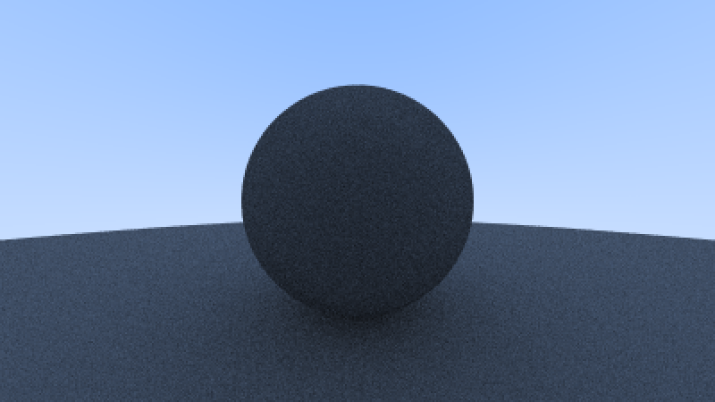

### 限制递归

限制递归层数

完整的camera.rs

```rust
use crate::color::Color;
use crate::hittable::{HitRecord, Hittable};
use crate::interval::Interval;
use crate::ray::Ray;
use crate::vec3::{Point3, Vec3};
use std::f64::INFINITY;
use std::io::{self, Write};

pub struct Camera {
    pub aspect_ratio: f64, // 图像宽高比
    pub image_width: i32,  // 图像宽度
    pub samples_per_pixel: i32,
    pub max_depth: i32,

    // 私有计算变量
    pixel_samples_scale: f64,
    image_height: i32,   // 图像高度
    center: Point3,      // 相机中心
    pixel00_loc: Point3, // 像素 (0,0) 的位置
    pixel_delta_u: Vec3, // 相邻像素水平间距
    pixel_delta_v: Vec3, // 相邻像素垂直间距
}

impl Camera {
    pub fn new() -> Self {
        let samples_per_pixel = 100;
        let pixel_samples_scale = 1.0 / samples_per_pixel as f64;

        Self {
            aspect_ratio: 1.0,
            image_width: 100,
            image_height: 0,
            samples_per_pixel,
            pixel_samples_scale,
            max_depth: 10,
            center: Point3::new(0.0, 0.0, 0.0),
            pixel00_loc: Point3::new(0.0, 0.0, 0.0),
            pixel_delta_u: Vec3::new(0.0, 0.0, 0.0),
            pixel_delta_v: Vec3::new(0.0, 0.0, 0.0),
        }
    }

    pub fn render(&mut self, world: &dyn Hittable) -> std::io::Result<()> {
        self.initialize();

        // 打印 PPM 格式头
        println!("P3\n{} {}\n255", self.image_width, self.image_height);

        for j in 0..self.image_height {
            eprint!("\rScanlines remaining: {:3} ", self.image_height - j);
            io::stderr().flush()?;

            for i in 0..self.image_width {
                let mut pixel_color = Color::new(0.0, 0.0, 0.0);
                for _sample in 0..self.samples_per_pixel {
                    let r = self.get_ray(i, j);
                    pixel_color += self.ray_color(&r, world, self.max_depth);
                }
                crate::color::write_color(
                    &mut io::stdout(),
                    self.pixel_samples_scale * pixel_color,
                )?;
            }
        }
        eprint!("\rDone.                 \n");
        io::stderr().flush()?;
        Ok(())
    }

    fn initialize(&mut self) {
        // 计算图像高度，确保至少为 1
        self.image_height = (self.image_width as f64 / self.aspect_ratio) as i32;
        if self.image_height < 1 {
            self.image_height = 1;
        }

        self.center = Point3::new(0.0, 0.0, 0.0);

        // 视口 (Viewport) 设置
        let focal_length = 1.0;
        let viewport_height = 2.0;
        let viewport_width = viewport_height * (self.image_width as f64 / self.image_height as f64);

        // 计算视口边沿向量
        let viewport_u = Vec3::new(viewport_width, 0.0, 0.0);
        let viewport_v = Vec3::new(0.0, -viewport_height, 0.0);

        // 计算像素间距向量
        self.pixel_delta_u = viewport_u / self.image_width as f64;
        self.pixel_delta_v = viewport_v / self.image_height as f64;

        // 计算左上角像素位置
        let viewport_upper_left =
            self.center - Vec3::new(0.0, 0.0, focal_length) - viewport_u / 2.0 - viewport_v / 2.0;

        self.pixel00_loc = viewport_upper_left + 0.5 * (self.pixel_delta_u + self.pixel_delta_v);
    }

    fn ray_color(&self, r: &Ray, world: &dyn Hittable, depth: i32) -> Color {
        if depth <= 0 {
            return Color::new(0.0, 0.0, 0.0);
        }

        let mut rec: HitRecord = Default::default();

        // 使用 Interval 来定义光线的有效范围
        if world.hit(r, Interval::new(0.0, INFINITY), &mut rec) {
            let direction = Vec3::random_on_hemisphere(&rec.normal);
            return 0.5 * self.ray_color(&Ray::new(rec.p, direction), world, depth - 1);
        }

        let unit_direction = Vec3::unit_vector(r.direction());
        let a = 0.5 * (unit_direction.y() + 1.0);
        (1.0 - a) * Color::new(1.0, 1.0, 1.0) + a * Color::new(0.5, 0.7, 1.0) //背景
    }

    pub fn get_ray(&self, i: i32, j: i32) -> Ray {
        // Construct a camera ray originating from the origin and directed at randomly sampled
        // point around the pixel location i, j.

        let offset = self.sample_square();
        let pixel_sample = self.pixel00_loc
            + ((i as f64 + offset.x()) * self.pixel_delta_u)
            + ((j as f64 + offset.y()) * self.pixel_delta_v);

        let ray_origin = self.center;
        let ray_direction = pixel_sample - ray_origin;

        Ray::new(ray_origin, ray_direction)
    }

    fn sample_square(&self) -> Vec3 {
        // Returns the vector to a random point in the [-.5,-.5]-[+.5,+.5] unit square.
        Vec3::new(
            crate::random_double() - 0.5,
            crate::random_double() - 0.5,
            0.0,
        )
    }
}

```

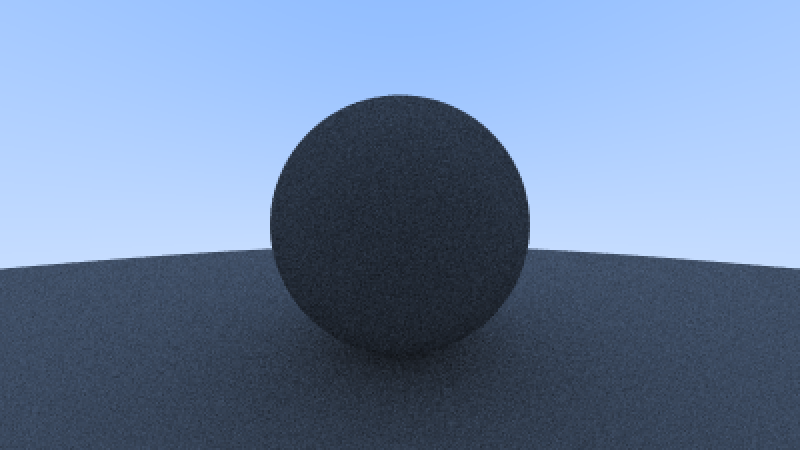

## Shadow Acne

忽略很近的碰撞

```rust
        if world.hit(r, Interval::new(0.001, INFINITY), &mut rec) {
            let direction = Vec3::random_on_hemisphere(&rec.normal);
            return 0.5 * self.ray_color(&Ray::new(rec.p, direction), world, depth - 1);
        }
```

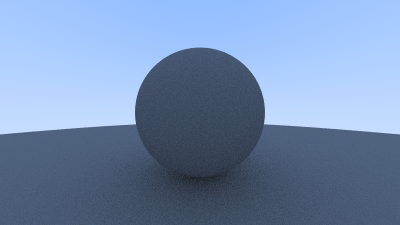
确实光滑不少，其实上述三个例子还可以观察运行的进度，也是逐渐变块的，不只是总的速度，可以发现通常后半部分的像素速度速度是慢的，因为球和平面（其实是个巨大的球）在这里碰撞，速度变化较为明显的也是这里

## 朗伯特反射（True Lambertian Reflection）

反射更可能朝着法线而不是切线，并且呈现余弦规律

```rust
        if world.hit(r, Interval::new(0.001, INFINITY), &mut rec) {
            let direction = rec.normal + Vec3::random_unit_vector();
            // let direction = Vec3::random_on_hemisphere(&rec.normal);
            return 0.5 * self.ray_color(&Ray::new(rec.p, direction), world, depth - 1);
        }
```

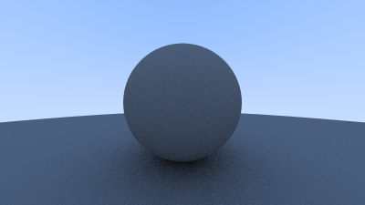

## Gamma矫正

更新color.rs

```rust
use crate::{interval, vec3::Vec3};
use std::io::{Write};
pub type Color = Vec3;

#[inline]
pub fn linear_to_gamma(linear_component: f64) -> f64 {
    if linear_component > 0.0 {
        linear_component.sqrt()
    } else {
        0.0
    }
}

pub fn write_color<W: Write>(out: &mut W, pixel_color: Color) -> std::io::Result<()> {
    let r = pixel_color.x();
    let g = pixel_color.y();
    let b = pixel_color.z();

    // gamma 校正
    let r = linear_to_gamma(r);
    let g = linear_to_gamma(g);
    let b = linear_to_gamma(b);

    // 将 [0,1] 映射到字节范围 [0,255]
    let interval_ = interval::Interval::new(0.0, 0.999);
  
    let rbyte = (255.999 * interval_.clamp(r)) as i32;
    let gbyte = (255.999 * interval_.clamp(g)) as i32;
    let bbyte = (255.999 * interval_.clamp(b)) as i32;

    // 写入像素颜色分量
    writeln!(out, "{} {} {}", rbyte, gbyte, bbyte)
}

```

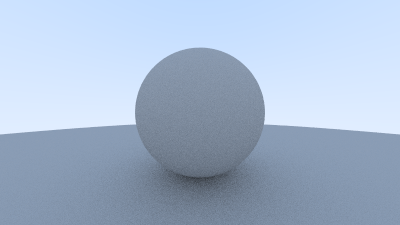

## 金属材质(metal)

### 材质类

material.rs

```rust
use crate::hittable::HitRecord;
use crate::ray::Ray;
use crate::color::Color;

pub trait Material: Send + Sync {
    fn scatter(
        &self,
        r_in: &Ray,
        rec: &HitRecord,
        attenuation: &mut Color,
        scattered: &mut Ray,
    ) -> bool;
}

```

更新hittable.rs

```rust
use crate::interval::Interval;
use crate::ray::Ray;
use crate::vec3::{Point3, Vec3};
use std::sync::Arc;

pub type MatPtr = Arc<dyn crate::material::Material>;

#[derive(Clone)]
pub struct HitRecord {
    pub p: Point3,
    pub normal: Vec3,
    pub t: f64,
    pub front_face: bool,
    pub mat: Option<MatPtr>,
}

impl HitRecord {
    pub fn set_face_normal(&mut self, r: &Ray, outward_normal: Vec3) {
        self.front_face = Vec3::dot(&r.direction(), &outward_normal) < 0.0;
        self.normal = if self.front_face {
            outward_normal
        } else {
            -outward_normal
        };
    }
}

impl Default for HitRecord {
    fn default() -> Self {
        Self {
            p: Point3::new(0.0, 0.0, 0.0),
            normal: Vec3::new(0.0, 0.0, 0.0),
            t: 0.0,
            front_face: false,
            mat: None,
        }
    }
}

pub trait Hittable: Send + Sync {
    fn hit(&self, r: &Ray, ray_t: Interval, rec: &mut HitRecord) -> bool;
}

```

更新**sphere**.rs

```rust
use crate::hittable::{HitRecord, Hittable, MatPtr};
use crate::interval::Interval;
use crate::ray::Ray;
use crate::vec3::{Point3, Vec3};

pub struct Sphere {
    center: Point3,
    radius: f64,
    mat: MatPtr,
}

impl Sphere {
    pub fn new(center: Point3, radius: f64, mat: MatPtr) -> Self {
        Self {
            center,
            radius: radius.max(0.0),
            mat,
        }
    }
}

impl Hittable for Sphere {
    fn hit(&self, r: &Ray, ray_t: Interval, rec: &mut HitRecord) -> bool {
        let oc = self.center - r.origin();
        let a = r.direction().length_squared();
        let h = Vec3::dot(&r.direction(), &oc);
        let c = oc.length_squared() - self.radius * self.radius;

        let discriminant = h * h - a * c;
        if discriminant < 0.0 {
            return false;
        }

        let sqrtd = discriminant.sqrt();

        // 寻找在范围内最近的根
        let mut root = (h - sqrtd) / a;
        if root <= ray_t.min || ray_t.max <= root {
            root = (h + sqrtd) / a;
            if root <= ray_t.min || ray_t.max <= root {
                return false;
            }
        }

        rec.t = root;
        rec.p = r.at(rec.t);
        let outward_normal = (rec.p - self.center) / self.radius;

        rec.set_face_normal(r, outward_normal);
        rec.mat = Some(self.mat.clone());

        true
    }
}

```

### 光散射和反射建模

光反射的系数封装一下

有两种方案，有概率不反射和总是以某系数反射，我们采用后者（统计上一样，后者更少噪点）

防止最后向量变0，还要做一下限制

vec3.rs

```rust
......
    pub fn length_squared(&self) -> f64 {
        self.e[0] * self.e[0] + self.e[1] * self.e[1] + self.e[2] * self.e[2]
    }

    pub fn near_zero(&self) -> bool {
        // Return true if the vector is close to zero in all dimensions.
        let s = 1e-8;
        (self.e[0].abs() < s) && (self.e[1].abs() < s) && (self.e[2].abs() < s)
    }
```

material.rs

```rust
use crate::color::Color;
use crate::hittable::HitRecord;
use crate::ray::Ray;
use crate::vec3::Vec3;

pub trait Material: Send + Sync {
    fn scatter(
        &self,
        r_in: &Ray,
        rec: &HitRecord,
        attenuation: &mut Color,
        scattered: &mut Ray,
    ) -> bool;
}

/// Lambertian (diffuse) material
/// Always scatters light according to its albedo (reflectance)
pub struct Lambertian {
    albedo: Color,
}

impl Lambertian {
    pub fn new(albedo: Color) -> Self {
        Self { albedo }
    }
}

impl Material for Lambertian {
    fn scatter(
        &self,
        _r_in: &Ray,
        rec: &HitRecord,
        attenuation: &mut Color,
        scattered: &mut Ray,
    ) -> bool {
        let mut scatter_direction = rec.normal + Vec3::random_unit_vector();

        // Catch degenerate scatter direction
        if scatter_direction.near_zero() {
            scatter_direction = rec.normal;
        }

        *scattered = Ray::new(rec.p, scatter_direction);
        *attenuation = self.albedo;
        true
    }
}

```

在ray_color中应用

```rust

    fn ray_color(&self, r: &Ray, world: &dyn Hittable, depth: i32) -> Color {
        if depth <= 0 {
            return Color::new(0.0, 0.0, 0.0);
        }

        let mut rec: HitRecord = Default::default();

        // 使用 Interval 来定义光线的有效范围
        if world.hit(r, Interval::new(0.001, INFINITY), &mut rec) {
            let mut scattered = Ray::new(Point3::new(0.0, 0.0, 0.0), Vec3::new(0.0, 0.0, 0.0));
            let mut attenuation = Color::new(0.0, 0.0, 0.0);

            if let Some(mat) = &rec.mat {
                if mat.scatter(r, &rec, &mut attenuation, &mut scattered) {
                    return attenuation * self.ray_color(&scattered, world, depth - 1);
                }
            }
            return Color::new(0.0, 0.0, 0.0);
        }

        let unit_direction = Vec3::unit_vector(r.direction());
        let a = 0.5 * (unit_direction.y() + 1.0);
        (1.0 - a) * Color::new(1.0, 1.0, 1.0) + a * Color::new(0.5, 0.7, 1.0) //背景
    }
```

### 镜面反射

反射向量是v加上其在法线上投影大小的b两倍

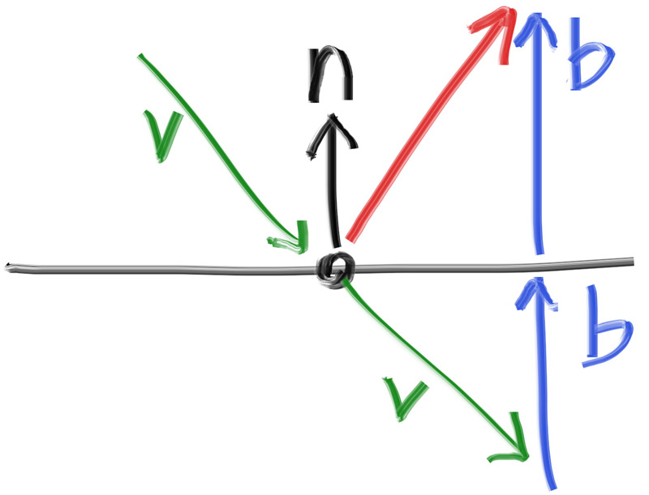
vec.rs

```rust
    pub fn reflect(v: &Vec3, n: &Vec3) -> Vec3 {
        // Reflect vector v about normal n
        // Formula: v - 2*(v·n)*n
        *v - 2.0 * Vec3::dot(v, n) * *n
    }
```

material.rs中添加metal

```rust
pub struct Metal {
    albedo: Color,
}

impl Metal {
    pub fn new(albedo: Color) -> Self {
        Self { albedo }
    }
}

impl Material for Metal {
    fn scatter(
        &self,
        r_in: &Ray,
        rec: &HitRecord,
        attenuation: &mut Color,
        scattered: &mut Ray,
    ) -> bool {
        let reflected = Vec3::reflect(&r_in.direction(), &rec.normal);
        *scattered = Ray::new(rec.p, reflected);
        *attenuation = self.albedo;
        true
    }
}
```

记得更新lib.rs

### 更新演示场景

更新main

```rust
use std::sync::Arc;
use trweekend4r::{Camera, Color, HittableList, Lambertian, Metal, Point3, Sphere};

fn main() -> std::io::Result<()> {
    // 创建世界
    let mut world = HittableList::new();

    // 创建不同的材质
    let material_ground = Arc::new(Lambertian::new(Color::new(0.8, 0.8, 0.0)));
    let material_center = Arc::new(Lambertian::new(Color::new(0.1, 0.2, 0.5)));
    let material_left = Arc::new(Metal::new(Color::new(0.8, 0.8, 0.8)));
    let material_right = Arc::new(Metal::new(Color::new(0.8, 0.6, 0.2)));

    // 添加球体
    world.add(Arc::new(Sphere::new(
        Point3::new(0.0, -100.5, -1.0),
        100.0,
        material_ground,
    )));
    world.add(Arc::new(Sphere::new(
        Point3::new(0.0, 0.0, -1.2),
        0.5,
        material_center,
    )));
    world.add(Arc::new(Sphere::new(
        Point3::new(-1.0, 0.0, -1.0),
        0.5,
        material_left,
    )));
    world.add(Arc::new(Sphere::new(
        Point3::new(1.0, 0.0, -1.0),
        0.5,
        material_right,
    )));

    // 创建并配置摄像机
    let mut camera = Camera::new();
    camera.aspect_ratio = 16.0 / 9.0;
    camera.image_width = 400;
    camera.samples_per_pixel = 100;
    camera.max_depth = 50;

    // 渲染
    camera.render(&world)
}
```

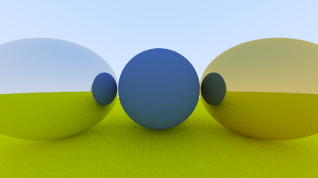

### 模糊反射

模糊反射就是为反射向量的终点添加一个向量以实现较为随机的反射达到模糊效果

material.rs

```rust
pub struct Metal {
    albedo: Color,
    fuzz: f64,
}

impl Metal {
    pub fn new(albedo: Color, fuzz: f64) -> Self {
        let fuzz = if fuzz < 1.0 { fuzz } else { 1.0 };
        Self { albedo, fuzz }
    }
}
```

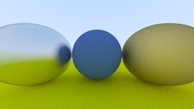

其实看上去感觉噪点更多了，一方面确实多了些，不过更多的是视觉上显得更明显了

## Dielectrics

这章主要是折射，dielectrics是电介质的意思，感觉直翻不太对，反正就是dielectrics

首先更新vec3加入reflection

```rust
...
    pub fn refract(uv: &Vec3, n: &Vec3, etai_over_etat: f64) -> Vec3 {
        // Refract according to Snell's law
        let cos_theta = Vec3::dot(&-*uv, n).min(1.0);
        let r_out_perp = etai_over_etat * (*uv + cos_theta * *n);
        let r_out_parallel = -(1.0 - r_out_perp.length_squared()).abs().sqrt() * *n;
        r_out_perp + r_out_parallel
    }
```

我们在material中实现

```rust
pub struct Dielectric {
    refraction_index: f64,
}

impl Dielectric {
    pub fn new(refraction_index: f64) -> Self {
        Self { refraction_index }
    }
}

impl Material for Dielectric {
    fn scatter(
        &self,
        r_in: &Ray,
        rec: &HitRecord,
        attenuation: &mut Color,
        scattered: &mut Ray,
    ) -> bool {
        *attenuation = Color::new(1.0, 1.0, 1.0);
        let ri = if rec.front_face {
            1.0 / self.refraction_index
        } else {
            self.refraction_index
        };

        let unit_direction = Vec3::unit_vector(r_in.direction());
        let refracted = Vec3::refract(&unit_direction, &rec.normal, ri);

        *scattered = Ray::new(rec.p, refracted);
        true
    }
}

```

最后更新一下main

```rust
use std::sync::Arc;
use trweekend4r::{Camera, Color, Dielectric, HittableList, Lambertian, Metal, Point3, Sphere};

fn main() -> std::io::Result<()> {
    // 创建世界
    let mut world = HittableList::new();

    // 创建不同的材质
    let material_ground = Arc::new(Lambertian::new(Color::new(0.8, 0.8, 0.0)));
    let material_center = Arc::new(Lambertian::new(Color::new(0.1, 0.2, 0.5)));
    let material_left = Arc::new(Dielectric::new(1.50));
    let material_right = Arc::new(Metal::new(Color::new(0.8, 0.6, 0.2), 1.0));

    // 添加球体
    world.add(Arc::new(Sphere::new(
        Point3::new(0.0, -100.5, -1.0),
        100.0,
        material_ground,
    )));
    world.add(Arc::new(Sphere::new(
        Point3::new(0.0, 0.0, -1.2),
        0.5,
        material_center,
    )));
    world.add(Arc::new(Sphere::new(
        Point3::new(-1.0, 0.0, -1.0),
        0.5,
        material_left,
    )));
    world.add(Arc::new(Sphere::new(
        Point3::new(1.0, 0.0, -1.0),
        0.5,
        material_right,
    )));

    // 创建并配置摄像机
    let mut camera = Camera::new();
    camera.aspect_ratio = 16.0 / 9.0;
    camera.image_width = 400;
    camera.samples_per_pixel = 100;
    camera.max_depth = 50;

    // 渲染
    camera.render(&world)
}

```

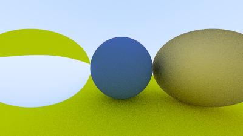

### 全反射处理

超过全反射就不进行折射

```rust
impl Material for Dielectric {
    fn scatter(
        &self,
        r_in: &Ray,
        rec: &HitRecord,
        attenuation: &mut Color,
        scattered: &mut Ray,
    ) -> bool {
        *attenuation = Color::new(1.0, 1.0, 1.0);
        let ri = if rec.front_face {
            1.0 / self.refraction_index
        } else {
            self.refraction_index
        };

        let unit_direction = Vec3::unit_vector(r_in.direction());
        let cos_theta = Vec3::dot(&-unit_direction, &rec.normal).min(1.0);
        let sin_theta = (1.0 - cos_theta * cos_theta).sqrt();

        // Check for total internal reflection
        let cannot_refract = ri * sin_theta > 1.0;
        let direction = if cannot_refract {
            // Total internal reflection
            Vec3::reflect(&unit_direction, &rec.normal)
        } else {
            // Can refract
            Vec3::refract(&unit_direction, &rec.normal, ri)
        };

        *scattered = Ray::new(rec.p, direction);
        true
    }
}


```

更新main.rs

```rust
use std::sync::Arc;
use trweekend4r::{Camera, Color, Dielectric, HittableList, Lambertian, Metal, Point3, Sphere};

fn main() -> std::io::Result<()> {
    // 创建世界
    let mut world = HittableList::new();

    // 创建不同的材质
    let material_ground = Arc::new(Lambertian::new(Color::new(0.8, 0.8, 0.0)));
    let material_center = Arc::new(Lambertian::new(Color::new(0.1, 0.2, 0.5)));
    let material_left = Arc::new(Dielectric::new(1.00 / 1.33));
    let material_right = Arc::new(Metal::new(Color::new(0.8, 0.6, 0.2), 1.0));

    // 添加球体
    world.add(Arc::new(Sphere::new(
        Point3::new(0.0, -100.5, -1.0),
        100.0,
        material_ground,
    )));
    world.add(Arc::new(Sphere::new(
        Point3::new(0.0, 0.0, -1.2),
        0.5,
        material_center,
    )));
    world.add(Arc::new(Sphere::new(
        Point3::new(-1.0, 0.0, -1.0),
        0.5,
        material_left,
    )));
    world.add(Arc::new(Sphere::new(
        Point3::new(1.0, 0.0, -1.0),
        0.5,
        material_right,
    )));

    // 创建并配置摄像机
    let mut camera = Camera::new();
    camera.aspect_ratio = 16.0 / 9.0;
    camera.image_width = 400;
    camera.samples_per_pixel = 100;
    camera.max_depth = 50;

    // 渲染
    camera.render(&world)
}

```

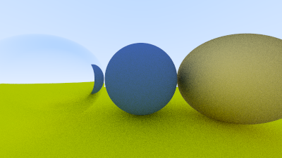

这样看起来就正常多了

### Schlick

不使用菲涅尔，而是采用近似的方法也就是Schlick approximation

```rust

pub struct Dielectric {
    refraction_index: f64,
}

impl Dielectric {
    pub fn new(refraction_index: f64) -> Self {
        Self { refraction_index }
    }

    fn reflectance(cosine: f64, refraction_index: f64) -> f64 {
        let r0 = (1.0 - refraction_index) / (1.0 + refraction_index);
        let r0 = r0 * r0;
        r0 + (1.0 - r0) * (1.0 - cosine).powi(5)
    }
}

impl Material for Dielectric {
    fn scatter(
        &self,
        r_in: &Ray,
        rec: &HitRecord,
        attenuation: &mut Color,
        scattered: &mut Ray,
    ) -> bool {
        *attenuation = Color::new(1.0, 1.0, 1.0);
        let ri = if rec.front_face {
            1.0 / self.refraction_index
        } else {
            self.refraction_index
        };

        let unit_direction = Vec3::unit_vector(r_in.direction());
        let cos_theta = Vec3::dot(&-unit_direction, &rec.normal).min(1.0);
        let sin_theta = (1.0 - cos_theta * cos_theta).sqrt();

        let cannot_refract = ri * sin_theta > 1.0;
        let direction =
            if cannot_refract || Dielectric::reflectance(cos_theta, ri) > crate::random_double() {
                Vec3::reflect(&unit_direction, &rec.normal)
            } else {
                Vec3::refract(&unit_direction, &rec.normal, ri)
            };

        *scattered = Ray::new(rec.p, direction);
        true
    }
}
```

更新main

```rust
use std::sync::Arc;
use trweekend4r::{Camera, Color, Dielectric, HittableList, Lambertian, Metal, Point3, Sphere};

fn main() -> std::io::Result<()> {
    // 创建世界
    let mut world = HittableList::new();

    // 创建不同的材质
    let material_ground = Arc::new(Lambertian::new(Color::new(0.8, 0.8, 0.0)));
    let material_center = Arc::new(Lambertian::new(Color::new(0.1, 0.2, 0.5)));
    let material_left = Arc::new(Dielectric::new(1.50));
    let material_bubble = Arc::new(Dielectric::new(1.00 / 1.50));
    let material_right = Arc::new(Metal::new(Color::new(0.8, 0.6, 0.2), 0.0));

    // 添加球体
    world.add(Arc::new(Sphere::new(
        Point3::new(0.0, -100.5, -1.0),
        100.0,
        material_ground,
    )));
    world.add(Arc::new(Sphere::new(
        Point3::new(0.0, 0.0, -1.2),
        0.5,
        material_center,
    )));
    world.add(Arc::new(Sphere::new(
        Point3::new(-1.0, 0.0, -1.0),
        0.5,
        material_left,
    )));
    // 空心玻璃球的内层（空气）
    world.add(Arc::new(Sphere::new(
        Point3::new(-1.0, 0.0, -1.0),
        0.4,
        material_bubble,
    )));
    world.add(Arc::new(Sphere::new(
        Point3::new(1.0, 0.0, -1.0),
        0.5,
        material_right,
    )));

    // 创建并配置摄像机
    let mut camera = Camera::new();
    camera.aspect_ratio = 16.0 / 9.0;
    camera.image_width = 400;
    camera.samples_per_pixel = 100;
    camera.max_depth = 50;

    // 渲染
    camera.render(&world)
}

```

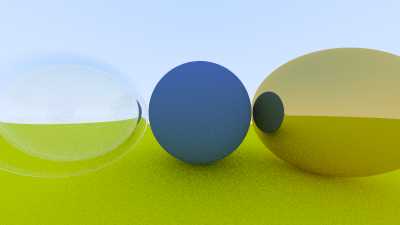

## 摄像机

后面两章都是关于摄像机和场景的位置的

camera.rs(记得在上面添加vfov字段)

```rust

    fn initialize(&mut self) {
        // 计算图像高度，确保至少为 1
        self.image_height = (self.image_width as f64 / self.aspect_ratio) as i32;
        if self.image_height < 1 {
            self.image_height = 1;
        }

        self.center = Point3::new(0.0, 0.0, 0.0);

        // 视口 (Viewport) 设置
        let focal_length = 1.0;

        // 根据垂直视场角计算视口高度
        let theta = crate::degrees_to_radians(self.vfov);
        let h = (theta / 2.0).tan();
        let viewport_height = 2.0 * h * focal_length;
        let viewport_width = viewport_height * (self.image_width as f64 / self.image_height as f64);

        // 计算视口边沿向量
        let viewport_u = Vec3::new(viewport_width, 0.0, 0.0);
        let viewport_v = Vec3::new(0.0, -viewport_height, 0.0);

        // 计算像素间距向量
        self.pixel_delta_u = viewport_u / self.image_width as f64;
        self.pixel_delta_v = viewport_v / self.image_height as f64;

        // 计算左上角像素位置
        let viewport_upper_left =
            self.center - Vec3::new(0.0, 0.0, focal_length) - viewport_u / 2.0 - viewport_v / 2.0;

        self.pixel00_loc = viewport_upper_left + 0.5 * (self.pixel_delta_u + self.pixel_delta_v);
    }
```

main.rs

```rust
use std::sync::Arc;
use trweekend4r::{Camera, Color, HittableList, Lambertian, Point3, Sphere};

fn main() -> std::io::Result<()> {
    // 创建世界
    let mut world = HittableList::new();

    // 计算球体半径（两个相切的球体）
    let r = (std::f64::consts::PI / 4.0).cos();

    // 创建不同的材质
    let material_left = Arc::new(Lambertian::new(Color::new(0.0, 0.0, 1.0)));
    let material_right = Arc::new(Lambertian::new(Color::new(1.0, 0.0, 0.0)));

    // 添加两个相切的球体
    world.add(Arc::new(Sphere::new(
        Point3::new(-r, 0.0, -1.0),
        r,
        material_left,
    )));
    world.add(Arc::new(Sphere::new(
        Point3::new(r, 0.0, -1.0),
        r,
        material_right,
    )));

    // 创建并配置摄像机
    let mut camera = Camera::new();
    camera.aspect_ratio = 16.0 / 9.0;
    camera.image_width = 400;
    camera.samples_per_pixel = 100;
    camera.max_depth = 50;
    camera.vfov = 90.0;

    // 渲染
    camera.render(&world)
}

```

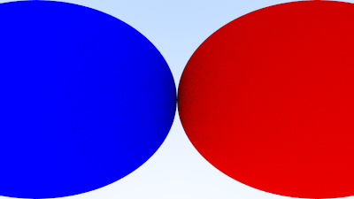

当然还要有能够操作摄像机位置

给出完整的camera.rs

```rust
use crate::color::Color;
use crate::hittable::{HitRecord, Hittable};
use crate::interval::Interval;
use crate::ray::Ray;
use crate::vec3::{Point3, Vec3};
use std::f64::INFINITY;
use std::io::{self, Write};

pub struct Camera {
    pub aspect_ratio: f64, // 图像宽高比
    pub image_width: i32,  // 图像宽度
    pub samples_per_pixel: i32,
    pub max_depth: i32,
    pub vfov: f64,        // 垂直视场角（度数）
    pub lookfrom: Point3, // 摄像机位置
    pub lookat: Point3,   // 看向的点
    pub vup: Vec3,        // 摄像机向上方向

    // 私有计算变量
    pixel_samples_scale: f64,
    image_height: i32,   // 图像高度
    center: Point3,      // 相机中心
    pixel00_loc: Point3, // 像素 (0,0) 的位置
    pixel_delta_u: Vec3, // 相邻像素水平间距
    pixel_delta_v: Vec3, // 相邻像素垂直间距
    u: Vec3,             // 摄像机坐标系右向量
    v: Vec3,             // 摄像机坐标系上向量
    w: Vec3,             // 摄像机坐标系后向量
}

impl Camera {
    pub fn new() -> Self {
        let samples_per_pixel = 100;
        let pixel_samples_scale = 1.0 / samples_per_pixel as f64;

        Self {
            aspect_ratio: 1.0,
            image_width: 100,
            image_height: 0,
            samples_per_pixel,
            pixel_samples_scale,
            max_depth: 10,
            vfov: 90.0,
            lookfrom: Point3::new(0.0, 0.0, 0.0),
            lookat: Point3::new(0.0, 0.0, -1.0),
            vup: Vec3::new(0.0, 1.0, 0.0),
            center: Point3::new(0.0, 0.0, 0.0),
            pixel00_loc: Point3::new(0.0, 0.0, 0.0),
            pixel_delta_u: Vec3::new(0.0, 0.0, 0.0),
            pixel_delta_v: Vec3::new(0.0, 0.0, 0.0),
            u: Vec3::new(1.0, 0.0, 0.0),
            v: Vec3::new(0.0, 1.0, 0.0),
            w: Vec3::new(0.0, 0.0, 1.0),
        }
    }

    pub fn render(&mut self, world: &dyn Hittable) -> std::io::Result<()> {
        self.initialize();

        // 打印 PPM 格式头
        println!("P3\n{} {}\n255", self.image_width, self.image_height);

        for j in 0..self.image_height {
            eprint!("\rScanlines remaining: {:3} ", self.image_height - j);
            io::stderr().flush()?;

            for i in 0..self.image_width {
                let mut pixel_color = Color::new(0.0, 0.0, 0.0);
                for _sample in 0..self.samples_per_pixel {
                    let r = self.get_ray(i, j);
                    pixel_color += self.ray_color(&r, world, self.max_depth);
                }
                crate::color::write_color(
                    &mut io::stdout(),
                    self.pixel_samples_scale * pixel_color,
                )?;
            }
        }
        eprint!("\rDone.                 \n");
        io::stderr().flush()?;
        Ok(())
    }

    fn initialize(&mut self) {
        // 计算图像高度，确保至少为 1
        self.image_height = (self.image_width as f64 / self.aspect_ratio) as i32;
        if self.image_height < 1 {
            self.image_height = 1;
        }

        self.center = self.lookfrom;

        // 视口 (Viewport) 设置
        let focal_length = (self.lookfrom - self.lookat).length();

        // 根据垂直视场角计算视口高度
        let theta = crate::degrees_to_radians(self.vfov);
        let h = (theta / 2.0).tan();
        let viewport_height = 2.0 * h * focal_length;
        let viewport_width = viewport_height * (self.image_width as f64 / self.image_height as f64);

        // 计算摄像机坐标系基向量
        self.w = Vec3::unit_vector(self.lookfrom - self.lookat);
        self.u = Vec3::unit_vector(Vec3::cross(&self.vup, &self.w));
        self.v = Vec3::cross(&self.w, &self.u);

        // 计算视口边沿向量（使用摄像机坐标系）
        let viewport_u = viewport_width * self.u;
        let viewport_v = viewport_height * (-self.v);

        // 计算像素间距向量
        self.pixel_delta_u = viewport_u / self.image_width as f64;
        self.pixel_delta_v = viewport_v / self.image_height as f64;

        // 计算左上角像素位置
        let viewport_upper_left =
            self.center - (focal_length * self.w) - viewport_u / 2.0 - viewport_v / 2.0;

        self.pixel00_loc = viewport_upper_left + 0.5 * (self.pixel_delta_u + self.pixel_delta_v);
    }

    fn ray_color(&self, r: &Ray, world: &dyn Hittable, depth: i32) -> Color {
        if depth <= 0 {
            return Color::new(0.0, 0.0, 0.0);
        }

        let mut rec: HitRecord = Default::default();

        // 使用 Interval 来定义光线的有效范围
        if world.hit(r, Interval::new(0.001, INFINITY), &mut rec) {
            let mut scattered = Ray::new(Point3::new(0.0, 0.0, 0.0), Vec3::new(0.0, 0.0, 0.0));
            let mut attenuation = Color::new(0.0, 0.0, 0.0);

            if let Some(mat) = &rec.mat {
                if mat.scatter(r, &rec, &mut attenuation, &mut scattered) {
                    return attenuation * self.ray_color(&scattered, world, depth - 1);
                }
            }
            return Color::new(0.0, 0.0, 0.0);
        }

        let unit_direction = Vec3::unit_vector(r.direction());
        let a = 0.5 * (unit_direction.y() + 1.0);
        (1.0 - a) * Color::new(1.0, 1.0, 1.0) + a * Color::new(0.5, 0.7, 1.0) //背景
    }

    pub fn get_ray(&self, i: i32, j: i32) -> Ray {
        let offset = self.sample_square();
        let pixel_sample = self.pixel00_loc
            + ((i as f64 + offset.x()) * self.pixel_delta_u)
            + ((j as f64 + offset.y()) * self.pixel_delta_v);

        let ray_origin = self.center;
        let ray_direction = pixel_sample - ray_origin;

        Ray::new(ray_origin, ray_direction)
    }

    fn sample_square(&self) -> Vec3 {
        // Returns the vector to a random point in the [-.5,-.5]-[+.5,+.5] unit square.
        Vec3::new(
            crate::random_double() - 0.5,
            crate::random_double() - 0.5,
            0.0,
        )
    }
}

```

使用原来那个复杂的示例

```rust
use std::sync::Arc;
use trweekend4r::{Camera, Color, Dielectric, HittableList, Lambertian, Metal, Point3, Sphere};

fn main() -> std::io::Result<()> {
    // 创建世界
    let mut world = HittableList::new();

    // 创建不同的材质
    let material_ground = Arc::new(Lambertian::new(Color::new(0.8, 0.8, 0.0)));
    let material_center = Arc::new(Lambertian::new(Color::new(0.1, 0.2, 0.5)));
    let material_left = Arc::new(Dielectric::new(1.50));
    let material_bubble = Arc::new(Dielectric::new(1.00 / 1.50));
    let material_right = Arc::new(Metal::new(Color::new(0.8, 0.6, 0.2), 1.0));

    // 添加球体
    world.add(Arc::new(Sphere::new(
        Point3::new(0.0, -100.5, -1.0),
        100.0,
        material_ground,
    )));
    world.add(Arc::new(Sphere::new(
        Point3::new(0.0, 0.0, -1.2),
        0.5,
        material_center,
    )));
    world.add(Arc::new(Sphere::new(
        Point3::new(-1.0, 0.0, -1.0),
        0.5,
        material_left,
    )));
    // 空心玻璃球的内层（空气）
    world.add(Arc::new(Sphere::new(
        Point3::new(-1.0, 0.0, -1.0),
        0.4,
        material_bubble,
    )));
    world.add(Arc::new(Sphere::new(
        Point3::new(1.0, 0.0, -1.0),
        0.5,
        material_right,
    )));

    // 创建并配置摄像机
    let mut camera = Camera::new();
    camera.aspect_ratio = 16.0 / 9.0;
    camera.image_width = 400;
    camera.samples_per_pixel = 100;
    camera.max_depth = 50;
    camera.vfov = 90.0;
    camera.lookfrom = Point3::new(-2.0, 2.0, 1.0);
    camera.lookat = Point3::new(0.0, 0.0, -1.0);
    camera.vup = Point3::new(0.0, 1.0, 0.0);

    // 渲染
    camera.render(&world)
}

```

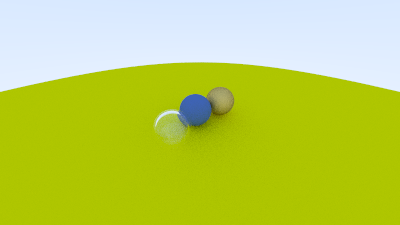

从别的角度看，这个泡泡和金属球其实还挺像回事的

## 散焦模糊(景深)

在vec3中实现

```rust
    pub fn random_in_unit_disk() -> Vec3 {
        // Returns a random point in the unit disk
        loop {
            let p = Vec3::new(
                crate::random_double_range(-1.0, 1.0),
                crate::random_double_range(-1.0, 1.0),
                0.0,
            );
            if p.length_squared() < 1.0 {
                return p;
            }
        }
    }
```

更新camera中关于景深的字段（记得初始化中也修改），然后为get_ray应用

```rust
...   
pub struct Camera {
    pub aspect_ratio: f64, // 图像宽高比
    pub image_width: i32,  // 图像宽度
    pub samples_per_pixel: i32,
    pub max_depth: i32,
    pub vfov: f64,          // 垂直视场角（度数）
    pub lookfrom: Point3,   // 摄像机位置
    pub lookat: Point3,     // 看向的点
    pub vup: Vec3,          // 摄像机向上方向
    pub defocus_angle: f64, // 散焦角度（度数）
    pub focus_dist: f64,    // 焦点距离

    // 私有计算变量
    pixel_samples_scale: f64,
    image_height: i32,    // 图像高度
    center: Point3,       // 相机中心
    pixel00_loc: Point3,  // 像素 (0,0) 的位置
    pixel_delta_u: Vec3,  // 相邻像素水平间距
    pixel_delta_v: Vec3,  // 相邻像素垂直间距
    u: Vec3,              // 摄像机坐标系右向量
    v: Vec3,              // 摄像机坐标系上向量
    w: Vec3,              // 摄像机坐标系后向量
    defocus_disk_u: Vec3, // 散焦圆盘水平半径
    defocus_disk_v: Vec3, // 散焦圆盘竖直半径
}
...
 pub fn get_ray(&self, i: i32, j: i32) -> Ray {
        let offset = self.sample_square();
        let pixel_sample = self.pixel00_loc
            + ((i as f64 + offset.x()) * self.pixel_delta_u)
            + ((j as f64 + offset.y()) * self.pixel_delta_v);

        let ray_origin = if self.defocus_angle <= 0.0 {
            self.center
        } else {
            self.defocus_disk_sample()
        };
        let ray_direction = pixel_sample - ray_origin;

        Ray::new(ray_origin, ray_direction)
    }

    fn defocus_disk_sample(&self) -> Point3 {
        // Returns a random point in the camera defocus disk.
        let p = Vec3::random_in_unit_disk();
        self.center + (p.x() * self.defocus_disk_u) + (p.y() * self.defocus_disk_v)
    }
```

main中更新摄像机

```rust
    let mut camera = Camera::new();
    camera.aspect_ratio = 16.0 / 9.0;
    camera.image_width = 400;
    camera.samples_per_pixel = 100;
    camera.max_depth = 50;
    camera.vfov = 20.0;
    camera.lookfrom = Point3::new(-2.0, 2.0, 1.0);
    camera.lookat = Point3::new(0.0, 0.0, -1.0);
    camera.vup = Point3::new(0.0, 1.0, 0.0);
    camera.defocus_angle = 10.0;
    camera.focus_dist = 3.4;
```

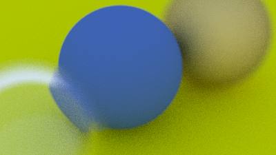

## 最后

最后是一个完整的示例，可能需要跑相当久，这里的图直接拿cpp版本跑的结果展示，不想再跑一遍了

```rust
use std::sync::Arc;
use trweekend4r::{
    Camera, Color, Dielectric, HittableList, Lambertian, Metal, Point3, Sphere, Vec3,
};

fn main() -> std::io::Result<()> {
    // 创建世界
    let mut world = HittableList::new();

    // 创建地面材质
    let ground_material = Arc::new(Lambertian::new(Color::new(0.5, 0.5, 0.5)));
    world.add(Arc::new(Sphere::new(
        Point3::new(0.0, -1000.0, 0.0),
        1000.0,
        ground_material,
    )));

    // 创建随机小球
    for a in -11..11 {
        for b in -11..11 {
            let choose_mat = trweekend4r::random_double();
            let center = Point3::new(
                a as f64 + 0.9 * trweekend4r::random_double(),
                0.2,
                b as f64 + 0.9 * trweekend4r::random_double(),
            );

            // 避免在固定位置创建球体
            if (center - Point3::new(4.0, 0.2, 0.0)).length() > 0.9 {
                let sphere_material: Arc<dyn trweekend4r::Material>;

                if choose_mat < 0.8 {
                    // 漫反射（80%）
                    let albedo = Vec3::random() * Vec3::random();
                    sphere_material = Arc::new(Lambertian::new(albedo));
                } else if choose_mat < 0.95 {
                    // 金属（15%）
                    let albedo = Vec3::random_range(0.5, 1.0);
                    let fuzz = trweekend4r::random_double_range(0.0, 0.5);
                    sphere_material = Arc::new(Metal::new(albedo, fuzz));
                } else {
                    // 玻璃（5%）
                    sphere_material = Arc::new(Dielectric::new(1.5));
                }

                world.add(Arc::new(Sphere::new(center, 0.2, sphere_material)));
            }
        }
    }

    // 三个大球体
    let material1 = Arc::new(Dielectric::new(1.5));
    world.add(Arc::new(Sphere::new(
        Point3::new(0.0, 1.0, 0.0),
        1.0,
        material1,
    )));

    let material2 = Arc::new(Lambertian::new(Color::new(0.4, 0.2, 0.1)));
    world.add(Arc::new(Sphere::new(
        Point3::new(-4.0, 1.0, 0.0),
        1.0,
        material2,
    )));

    let material3 = Arc::new(Metal::new(Color::new(0.7, 0.6, 0.5), 0.0));
    world.add(Arc::new(Sphere::new(
        Point3::new(4.0, 1.0, 0.0),
        1.0,
        material3,
    )));

    // 创建并配置摄像机
    let mut camera = Camera::new();
    camera.aspect_ratio = 16.0 / 9.0;
    camera.image_width = 1200;
    camera.samples_per_pixel = 500;
    camera.max_depth = 50;
    camera.vfov = 20.0;
    camera.lookfrom = Point3::new(13.0, 2.0, 3.0);
    camera.lookat = Point3::new(0.0, 0.0, 0.0);
    camera.vup = Vec3::new(0.0, 1.0, 0.0);
    camera.defocus_angle = 0.6;
    camera.focus_dist = 10.0;

    // 渲染
    camera.render(&world)
}

```

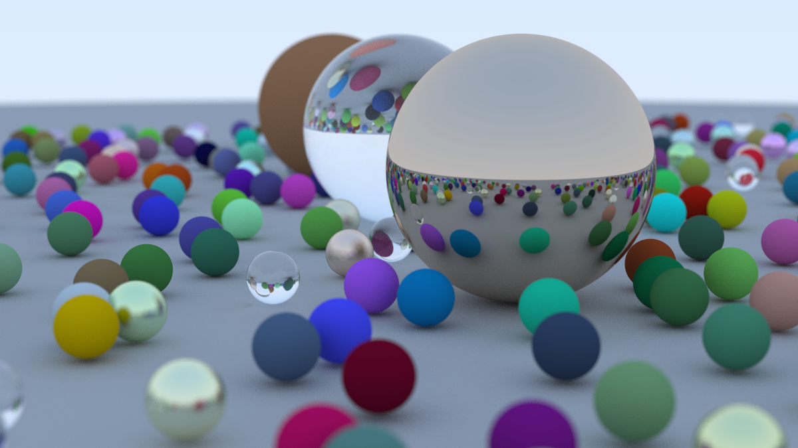

系列教程还有next week和rest of life, 也许会做
